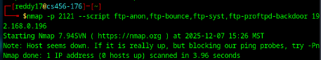
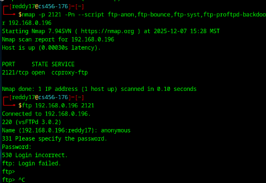
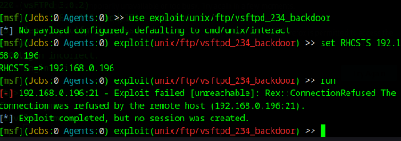

# Penetration Test Report: 192.168.0.196  
**Author:** Harshith Reddy Chitreddy  
**Date of Assessment:** 12/07/2025  
**Version:** 1.0  

---

## Table of Contents
- Executive Summary  
- Overview  
- High-Level Test Outcomes  
- Overall Risk Rating  
- Prioritized Recommendations  
- Test Scope and Methodology  
- Scope  
- Methodology  
- Detailed Findings  
- Failed Exploit Attempts  
- Conclusions  
- Summary of Attack Path  
- Overall Security Posture  
- Appendix  
- Tools Used  

---

## Executive Summary

### Overview
A controlled penetration test was conducted against the target virtual machine at IP address **192.168.0.196**. The purpose of this assessment was to identify exposed network services, analyze potential vulnerabilities, and attempt limited exploitation within the defined rules of engagement. The test followed standard penetration testing methodology including reconnaissance, enumeration, vulnerability analysis, and controlled exploitation attempts.

### High-Level Test Outcomes
The assessment successfully identified three exposed services: **SSH, HTTP, and FTP**. Multiple exploitation attempts were performed against these services; however, no successful unauthorized access was achieved. The results indicate that the system demonstrates **moderate defensive hardening**, with patched services and restricted access controls in place.

---

## Overall Risk Rating
**Overall Risk Rating: MEDIUM-LOW**  
While multiple services are exposed to the network, all tested services resisted exploitation. No remote code execution, unauthorized authentication, or data access was achieved during this engagement.

---

## Prioritized Recommendations
1. Restrict external access to the FTP service if not required.  
2. Investigate and correct the HTTP service timeout issue.  
3. Continue enforcing strong SSH authentication policies.  
4. Implement centralized logging and intrusion detection for long-term monitoring.  

---

## Test Scope and Methodology

### Scope
The scope of this penetration test was limited to the virtual machine and its services located at the following IP address:

- **In-Scope Target:** 192.168.0.196  
- **Out-of-Scope:** All other network devices were considered out of scope for this assessment.  
- No denial-of-service (DoS) attacks were performed.  
- No persistent malware was installed.  
- No lateral movement attempts were conducted.

---

### Methodology
The assessment followed a structured penetration testing workflow:

1. **Reconnaissance & Discovery**  
   Network scanning was conducted using Nmap with service detection and default scripts.

   **Nmap Scan Results:**

   

2. **Service Enumeration**  
   Identified services were manually tested for misconfigurations and known vulnerabilities.

3. **Exploitation Attempts**  
   Controlled exploitation attempts were made using Metasploit and manual interaction.

4. **Post-Attack Evaluation**  
   All failures and security controls were documented and analyzed.

---

## Detailed Findings

### 3.2 Finding 1: FTP Service – Hardened Configuration
- **Port:** 2121/tcp  
- **Service:** vsftpd 3.0.2  
- **Risk Rating:** Low  

**Description:**  
The FTP service was publicly accessible but running a patched version of vsftpd (3.0.2). Anonymous authentication was tested and explicitly denied. This configuration prevents unauthorized users from accessing the file system.

**Proof of Testing:**  
- Anonymous FTP login attempt failed.  
- Metasploit backdoor exploit for vsftpd 2.3.4 failed with connection refusal.

**Impact:**  
Prevents unauthorized file access and remote code execution via known FTP backdoors.

**Remediation:**  
No immediate remediation required. Continue maintaining patched versions and disable FTP externally if not required.

---

### 3.3 Finding 2: HTTP Service – Application Not Responding
- **Port:** 80/tcp  
- **Service:** nginx 1.29.3  
- **Risk Rating:** Medium  

**Description:**  
Although the HTTP service was detected as open through network scanning, direct browser access resulted in repeated connection timeouts. This suggests that the backend web application is either misconfigured, stopped, or restricted via internal access controls.

**Impact:**  
While this prevents web-based exploitation, it also indicates a possible service reliability issue.

**Remediation:**  
- Verify web backend services.  
- Ensure proper firewall and reverse proxy routing.  
- Validate whether external access is intended.

---

### 3.4 Finding 3: SSH Service – Secure Configuration
- **Port:** 22/tcp  
- **Service:** OpenSSH 9.0p2 (Debian)  
- **Risk Rating:** Low  

**Description:**  
The SSH service was running a modern and fully patched OpenSSH version. No public remote exploits exist for this version. Authentication controls prevented unauthorized access.

**Impact:**  
Strong resistance to credential attacks and remote exploitation.

**Remediation:**  
- Continue enforcing strong password and/or key-based authentication.  
- Disable root login if enabled.

---

## Failed Exploit Attempts

### 4.1 FTP Anonymous Authentication Attempt
- **Target:** FTP Service on TCP 2121  
- **Result:** Login failed  
- **Reason for Failure:** Anonymous access was disabled by configuration.

---

### 4.2 Metasploit vsftpd 2.3.4 Backdoor Exploit
- **Exploit Used:** exploit/unix/ftp/vsftpd_234_backdoor  
- **Result:** Connection refused  
- **Reason for Failure:** Target service was running vsftpd 3.0.2, which is not vulnerable to the historical backdoor.

---

### 4.3 Web Application Access Attempt
- **Target:** HTTP on TCP 80  
- **Result:** Connection timeout  
- **Reason for Failure:** Web application was unreachable due to internal misconfiguration or access restrictions.

---

## Conclusions

### Summary of Attack Path
The attack methodology followed this sequence:

1. Network reconnaissance via Nmap  
2. Identification of open services  
3. Controlled testing of FTP service  
4. Automated exploitation attempt via Metasploit  
5. Web service verification via browser  
6. SSH service security evaluation  

No stage resulted in a successful compromise.

---

### Overall Security Posture
The system demonstrates a **moderate-to-strong defensive posture**. All tested services resisted exploitation attempts through patched software, authentication controls, and restricted access. While service exposure exists, no critical vulnerabilities were identified.

---

## Appendix

### Tools Used
- Nmap  
- Metasploit Framework  
- Firefox browser  
- Kali Linux  
